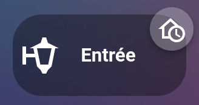
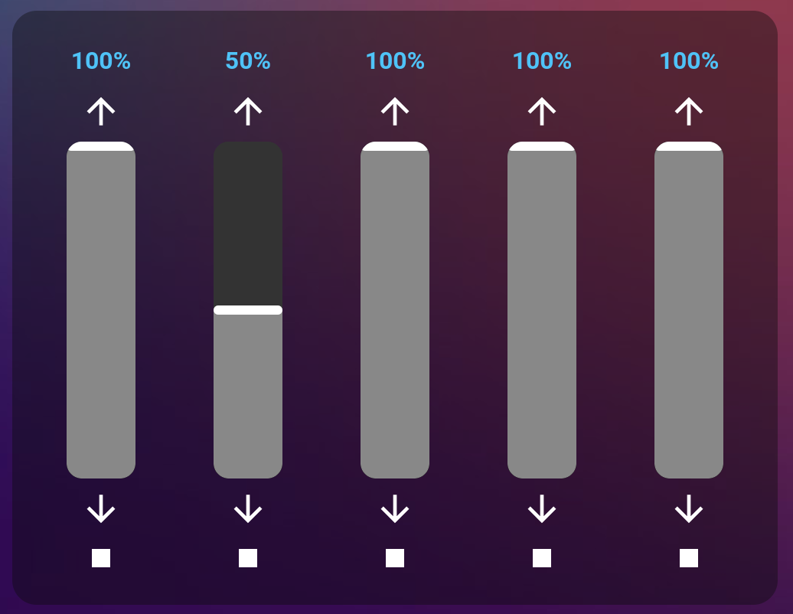
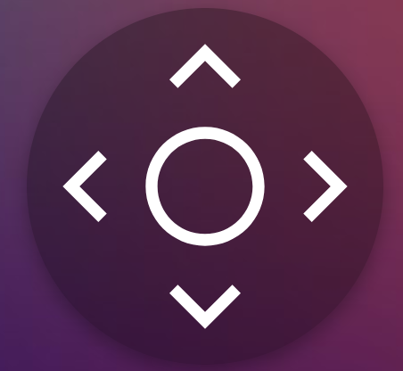
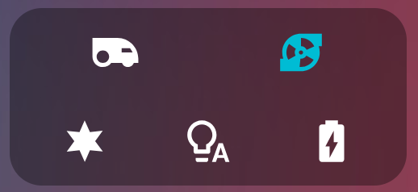
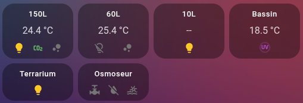
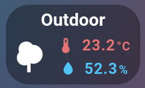

# HA Plooum Cards

**English** | [Français](https://github.com/plooum/HA-Plooum-Cards/blob/main/README.fr.md)

[](https://github.com/hacs/default)
[](LICENSE)

A collection of custom Lovelace cards for Home Assistant, packaged as **a single HACS plugin**. One install, one JavaScript resource, and each card is then available on its own in the Lovelace editor's card picker.

## Included cards

| Card | Lovelace type | Docs |
| :--- | :--- | :--- |
| Ha Plooum Button Badge Card | `custom:ha-plooum-buttonbadge-card` | [docs/button-badge.md](docs/button-badge.md) |
| Ha Plooum Cover Card | `custom:ha-plooum-cover-card` | [docs/cover.md](docs/cover.md) |
| Ha Plooum D-Pad Card | `custom:ha-plooum-dpad-card` | [docs/dpad.md](docs/dpad.md) |
| Ha Plooum Floorplan Card | `custom:ha-plooum-floorplan-card` | [docs/floorplan.md](docs/floorplan.md) |
| HA Plooum GridIcons Card | `custom:ha-plooum-gridicons-card` | [docs/gridicons.md](docs/gridicons.md) |
| HA Plooum Multi Status Card | `custom:ha-plooum-multi-status-card` | [docs/multistatus.md](docs/multistatus.md) |
| Ha Plooum Tabs Card | `custom:ha-plooum-tabs-card` | [docs/tabbed.md](docs/tabbed.md) |
| Ha Plooum Room Temp & Humidity Card | `custom:ha-plooum-temp-humidity-card` | [docs/temp-humidity.md](docs/temp-humidity.md) |
| HA Plooum Vivarium Card | `custom:ha-plooum-vivarium-card` | [docs/vivarium.md](docs/vivarium.md) |

---

### Ha Plooum Button Badge Card
A button combined with a floating badge, with a custom icon and text, and tap/hold actions (toggle, navigate, script).



### Ha Plooum Cover Card
Controls several roller shutters side by side, with vertical sliders, action icons and a safety lock.



### Ha Plooum D-Pad Card
A remote-control style directional pad, ideal for camera PTZ control.



### Ha Plooum Floorplan Card
A living plan of the house: lit rooms glow around their lamps, the floor takes the color of the temperature, and shutters close over the windows. With no configuration, the plan is generated from your Home Assistant areas; the editor then lets you draw your rooms and drag and drop your entities onto them, even if they are poorly organized in Home Assistant.

In **3D**, the same plan becomes a model of the house and garden, with an automatically generated roof: each camera's picture is shown on a screen placed in front of it, where it is looking, or in a floating thumbnail that always stays readable. A camera can also project its picture onto the floor and walls it films. Cameras are placed and aimed in the plan editor, which shows the plan over the camera's picture and can compute its orientation from a few points marked on the picture.


### HA Plooum GridIcons Card
A compact row of entity icons in a pill container, with state colors and tap/hold actions.



### HA Plooum Multi Status Card
A compact card to follow several boolean entities (light, pump, CO2...) around a main value (e.g. temperature).



### Ha Plooum Tabs Card
Organizes other cards into tabs, keeping their state in memory (ideal for camera streams).

*(no preview available for this card)*

### Ha Plooum Room Temp & Humidity Card
A compact temperature/humidity card with a main icon and fine-grained actions per sensor.



### HA Plooum Vivarium Card
An aquarium, a pond or a terrarium at a glance: its measures with their target range, its equipment (light, CO2, air pump, UV, heating...) and, in a banner at the top, what needs your attention ("Too hot · since 14:20", "UV unavailable"...). The card folds into a single line when it runs out of room, or with a click.


---

## Installation

### Method 1: HACS (recommended)
1. Open **HACS** in Home Assistant.
2. Go to **Frontend**.
3. Click the three dots in the top right corner > **Custom repositories**.
4. Add this repository's URL (`https://github.com/plooum/HA-Plooum-Cards`) and choose the **Plugin** category.
5. Click **Add**, search for `HA Plooum Cards`, then click **Download**.
6. Reload your browser.

### Method 2: Manual install
1. Download the `ha-plooum-cards.js` file from the latest release.
2. Copy it into your `www` folder (e.g. `/config/www/ha-plooum-cards.js`).
3. Add the resource in **Settings > Dashboards > Resources**:
   ```yaml
   resources:
     - url: /local/ha-plooum-cards.js
       type: module
   ```

Once the resource is loaded, each card shows up separately in the Lovelace editor's card picker (**Add card** button): you pick the cards you want one by one, like any other custom card.

---

## Development

All the cards are compiled together into a single file (`ha-plooum-cards.js`) with [Rollup](https://rollupjs.org/), from a single entry point ([src/index.js](src/index.js)) that imports every card. Each card stays independent: its own source file, its own custom element, its own entry in `window.customCards`.

```
src/
├── index.js                  # entry point: imports every card
└── cards/
    ├── button-badge/
    ├── cover/
    ├── dpad/
    ├── floorplan/
    ├── gridicons/
    ├── multistatus/
    ├── tabbed/
    ├── temp-humidity/
    └── vivarium/
```

### Build locally

```bash
npm install
npm run build
```

This regenerates `ha-plooum-cards.js` (and its sourcemap) at the root of the repository. This file is not versioned: GitHub Actions builds it on every push and every PR, and automatically attaches it to each published release.

### Test locally

The [dev/](dev/) folder contains a development Home Assistant (no Docker), with test entities and a dashboard that shows every card:

```bash
dev/ha.sh start   # then open http://127.0.0.1:8123/plooum-test/all
```

After an `npm run build`, just reload the page. The details (entities, dashboards, commands) are in [CLAUDE.md](CLAUDE.md#testing).

### Add a new card

1. Create a `src/cards/<card-name>/` folder containing the card's source file (with its own `customElements.define(...)` and `window.customCards.push(...)`, keeping the `if (!customElements.get(...))` existence guards to avoid duplicates).
2. Add an import line in [src/index.js](src/index.js):
   ```js
   import './cards/<card-name>/<file>.js';
   ```
3. Run `npm run build`.
4. Add a row to the table above (in both `README.md` and `README.fr.md`) and a `docs/<card-name>.md` file.

No other configuration (no new `rollup.config.mjs`, no new HACS resource) is needed: everything stays in the same bundle.

---

## License

[GPL-3.0](LICENSE)
