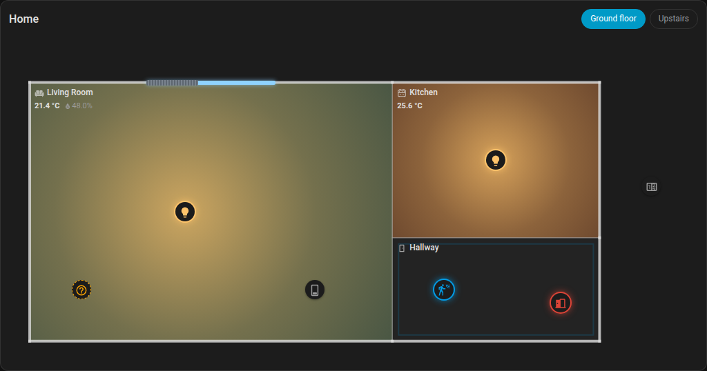
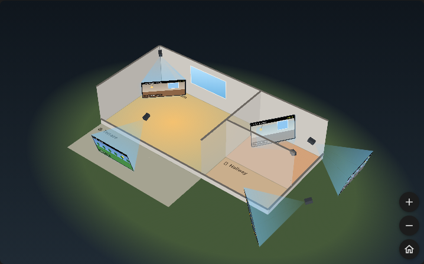

# Ha Plooum Floorplan Card

`type: custom:ha-plooum-floorplan-card`

A live floor plan of your home. Draw your rooms, drop your devices where they really are, and the plan comes alive: lit rooms glow around their lamps, floors take the color of the room temperature, shutters close on the windows, open doors turn red and rooms with motion pulse.

Switch it to **3D** and the same plan becomes a model of your home and garden, with a generated roof, where each camera shows its picture on a screen placed in front of it, where it looks (or on a floating screen that stays readable), and can even project it onto the floor and walls it films.





## Features

- **Zero configuration to start**: with no `floors`, the plan is generated from your Home Assistant floors and areas, with each area's entities placed in its room. The card picker preview already shows your home.
- **Visual plan editor**: draw rooms by dragging on a grid, move and resize them, and drag entities from a searchable list onto the plan. Your areas don't need to be right: an entity belongs to the room it is dropped in, wherever Home Assistant thinks it is.
- **Roles guessed from the entity**: lights glow, `temperature` / `humidity` sensors feed the room, covers become windows, `door` / `window` / `opening` binary sensors show alerts, `motion` / `occupancy` / `presence` sensors make the room pulse. Nothing to map by hand.
- **Interactive plan**: tap a device to toggle it (hold for its details), drag a shutter along its window to set its position, tap a room to zoom on it and list its devices with their controls (the plan grows taller if the room needs it). Tap another room to switch to it; close with the panel's ✕, `Escape` or a tap outside the rooms.
- **Several floors**, switched with chips at the top of the card.
- **Every state stays readable**: unavailable devices blink in grey, an entity that no longer exists shows as an orange dashed `?`.
- **Cameras**: on the plan, a cone shows where each camera looks (up to the first wall). In 3D, its picture is shown on a screen in front of it or on a floating screen, and can be projected onto the floor and walls. The editor shows the plan over the camera's picture, and can compute where the camera looks from a few matched points.
- **3D view** (the **2D / 3D** switch at the top of the card): the floors are stacked, outer walls get their windows and shutters, a hip roof is generated over the home, and outdoor rooms (garden, terrace) lie on the lawn.

## The 3D view

- **Drag** to turn around the home, **scroll** or **pinch** to zoom, **right-drag**, **Shift + drag** or drag with two fingers to pan. **Double-click** or the 🏠 button (or `Escape`) frames the whole home again.
- The chips at the top choose what is shown: a floor shows it and the floors below without their roof, with the walls facing you cut low like a dollhouse; the roof chip shows the whole home closed. Indoor cameras are only shown when their floor is open.
- **Camera screens** (`screen_mode`):
  - `world` (default): a screen stands in the scene in front of each camera, as far as its first wall. Seen from the front, a screen is flipped so that it stays readable.
  - `billboard`: each picture floats flat on the view next to its camera, linked to it by a line, and keeps the same readable size whatever the zoom. Screens move aside so as not to overlap.
  - `none`: no screens; the camera bar still flies to each camera.
- **Tap a camera's screen** to fly right behind the camera, facing its picture, which switches to the live stream; tap it again to open the camera's details. While zoomed on a camera, the `←` / `→` keys go to the previous / next one.
- **Camera bar**: the chips at the bottom of the view list every camera of the home. A tap flies to that camera, opening its floor first if needed (an indoor camera only shows when its floor is open).
- **Projection** (`projection: true` on a camera): the camera's picture is cast onto the floor and walls of its room, or outdoors onto the ground and the outdoor rooms of its floor, the way a projector standing where the camera is would light them. You see what the camera films right where it is in the home. The camera's setting must be right for the picture to fall in place: check it with the editor's camera view (below). Lens distortion isn't modeled (wide-angle pictures only match near their center), anything standing in the room is flattened onto the floor, and outdoors the house doesn't hide the ground behind it.
- Screens show a snapshot refreshed every 3 s (`refresh_interval`), or the live stream with `camera_view: live`. Projected pictures are always snapshots.
- Room names on the floor turn by quarter turns to read upright from where you look.
- Grid units are taken as meters: walls are 2.5 high (`wall_height`). The roof is a best effort: the plan says nothing about it, so a hip roof is generated over each part of the home that no floor covers.

## Using the editor

1. Add the card: the plan generated from your areas appears. Fix it, or click **Blank plan** to start from scratch.
2. **Draw a room**: drag on an empty spot of the grid. A drag that starts on a wall draws a room that shares it. Rooms snap to a half-unit grid.
3. **Move / resize a room**: drag it from the inside (its devices move with it); select it to get resize handles on its corners. Rename it and give it an icon in the form below the plan.
4. **Place an entity**: drag it from the list onto the plan, or click it to drop it in the middle of the selected room. Filter the list (Lights, Covers, Sensors…) or search by name, entity id or area.
5. **Covers stick to the nearest wall** and are drawn as windows: drop them on or near a wall.
6. **Cameras** (the **Cameras** filter lists them): drop one where it is mounted, for instance on an outer wall. It first looks at the middle of its room, or away from the home outdoors. Select it and drag the round handle in front of it to aim it, or set its direction, field of view, tilt and height in the form, along with the size and distance of its screen in 3D. A camera on an outer wall looking out is an outdoor camera.
   - **Camera view**: under the form, the camera's picture with your plan drawn over it as the camera sees it with these settings (the outline of its room's floor, the corners and tops of its walls; every room for an outdoor camera). The settings are right when the lines follow the room in the picture.
   - **Match points** computes the settings for you. Four numbered points appear on the picture and on a small plan under it (also on the main plan). Drag each point onto a spot of the floor you can recognize in the picture (a corner of the room, of a rug, a tile joint…), then the same number onto that spot on the plan. After each move, the direction, tilt, field of view and height that best fit the points are shown as green dashed lines, with the remaining error in pixels; rings show where the plan points land. **Apply** them when each ring sits on its point. Points must lie on the floor of the camera's level; spread them out, as far apart as the picture allows.
7. **Outdoor rooms**: draw a room for the garden or the terrace and tick **Outdoor**: it gets no walls and no roof.
8. **Remove an entity**: drag it out of the plan, or select it and click **Remove from plan**.
9. **Undo** (button or `Ctrl+Z`) reverts the last changes. With the plan focused, arrows move the selection, `Shift` + arrows resize a room, `Delete` removes it.
10. **Floors**: `+ Floor` adds one (floors are stacked in this order in 3D, the first one on the ground); select no room nor entity to rename or delete the current floor.

**From my areas** regenerates the whole plan from your areas (after confirmation).

## Configuration Parameters

The editor writes this configuration for you; it can also be written by hand. Positions and sizes are in grid units (one square of the editor grid); `x` grows to the right and `y` downwards.

### Card

| Parameter | Type | Default | Description |
| :--- | :--- | :--- | :--- |
| `type` | string | **Required** | `custom:ha-plooum-floorplan-card` |
| `title` | string | — | Title shown above the plan. |
| `temp_min` | number | `17` (`63` in °F) | Temperature shown as a blue floor. |
| `temp_max` | number | `27` (`81` in °F) | Temperature shown as a red floor. |
| `view` | string | `2d` | View shown when the card opens: `2d` or `3d`. |
| `roof` | boolean | `true` | In 3D, start with the whole home closed, with its roof. `false` starts on the top floor, open. |
| `wall_height` | number | `2.5` | Wall height in 3D, in grid units. |
| `camera_view` | string | `snapshot` | Camera screens in 3D: `snapshot` (an image refreshed every `refresh_interval`) or `live` (the live stream). |
| `refresh_interval` | number | `3` | Seconds between two snapshots of a camera. |
| `screen_mode` | string | `world` | Camera screens in 3D: `world` (in the scene, in front of the camera), `billboard` (floating flat on the view next to the camera) or `none`. |
| `floors` | list | generated | The plan, one item per floor (see below). Leave it out to generate the plan from your areas. |

### Floor (`floors` items)

| Parameter | Type | Description |
| :--- | :--- | :--- |
| `name` | string | Name shown on the floor chip. |
| `rooms` | list | Rooms of the floor (see below). |
| `entities` | list | Entities placed on the floor (see below). |

### Room (`rooms` items)

| Parameter | Type | Description |
| :--- | :--- | :--- |
| `name` | string | Room name, shown in its top-left corner. |
| `icon` | string | Optional MDI icon shown before the name. |
| `x`, `y` | number | Top-left corner. |
| `w`, `h` | number | Width and height. |
| `outdoor` | boolean | Garden, terrace…: no walls and no roof. |

Walls shared by two rooms are drawn thin; outer walls are drawn thick.

### Entity (`entities` items)

| Parameter | Type | Description |
| :--- | :--- | :--- |
| `entity` | string | Entity id. |
| `x`, `y` | number | Position. An entity belongs to the (smallest) room containing it. |
| `name` | string | Optional name, instead of the friendly name. |
| `icon` | string | Optional icon, instead of the state icon. |
| `length` | number | Covers only: window length, default `1.5`. |
| `direction` | number | Cameras only: where it looks, in degrees clockwise from the top of the plan (`0` up, `90` right). Default: the middle of its room, or away from the home outdoors. |
| `fov` | number | Cameras only: horizontal field of view, default `90`. |
| `tilt` | number | Cameras only: degrees looking down, default `15`. |
| `height` | number | Cameras only: height above the floor, default `2.2`. |
| `screen_size` | number | Cameras only: max width of its screen in 3D, default `2.4`. |
| `screen_distance` | number | Cameras only: max distance from the camera to its screen in 3D, default `2.5` (the screen always stops before the first wall). |
| `projection` | boolean | Cameras only: in 3D, project the picture onto the floor and walls the camera sees. Default `false`. |

How each entity is shown:

| Entity | On the plan |
| :--- | :--- |
| `light.*` | Icon; when on, a glow around it in the light's color, as bright as the light. |
| `sensor.*` with `device_class: temperature` | Room temperature (average if several) and floor color. Outside any room: a value badge. |
| `sensor.*` with `device_class: humidity` | Room humidity. Outside any room: a value badge. |
| other `sensor.*` | A value badge. |
| `cover.*` on a wall | A window with its shutter; drag along it to set the position. Off a wall: an icon. |
| `binary_sensor.*` door / window / opening | Icon, red when open. |
| `binary_sensor.*` motion / occupancy / presence | Icon; the room outline pulses when detected. |
| `climate.*` | Icon; its current temperature is used when the room has no temperature sensor. |
| `camera.*` | Icon and view cone. In 3D: the camera and its picture on a screen in front of it (or floating next to it), projected onto the room with `projection: true`. |
| anything else | Icon, highlighted when active. |

A tap toggles lights, switches, fans and input booleans, runs scenes, scripts and buttons, and opens the details of anything else. A long press always opens the details.

## Example

```yaml
type: custom:ha-plooum-floorplan-card
title: Home
view: 3d
floors:
  - name: Ground floor
    rooms:
      - { name: Living room, icon: "mdi:sofa", x: 0, y: 0, w: 7, h: 5 }
      - { name: Kitchen, icon: "mdi:stove", x: 7, y: 0, w: 4, h: 3 }
      - { name: Hallway, x: 7, y: 3, w: 4, h: 2 }
      - { name: Garden, icon: "mdi:flower", x: 0, y: 5, w: 11, h: 4, outdoor: true }
    entities:
      - { entity: light.living_room, x: 3, y: 2.5 }
      - { entity: sensor.living_room_temperature, x: 6, y: 1 }
      - { entity: cover.living_room, x: 3.5, y: 0, length: 2.5 }  # on the top wall
      - { entity: light.kitchen, x: 9, y: 1.5 }
      - { entity: binary_sensor.front_door, x: 10.25, y: 4.25 }
      - { entity: binary_sensor.hallway_motion, x: 8, y: 4 }
      - { entity: sensor.outdoor_temperature, x: 12, y: 2 }       # outside: a badge
      - { entity: camera.garden, x: 3.5, y: 5, direction: 180 }  # on the outer wall, looking at the garden
      - { entity: camera.living_room, x: 0.25, y: 0.25, direction: 135, fov: 110, tilt: 20, projection: true }
  - name: Upstairs
    rooms:
      - { name: Bedroom, icon: "mdi:bed", x: 0, y: 0, w: 5, h: 4 }
    entities:
      - { entity: light.bedroom, x: 2.5, y: 2 }
      - { entity: cover.bedroom, x: 0, y: 2 }                     # on the left wall
```
