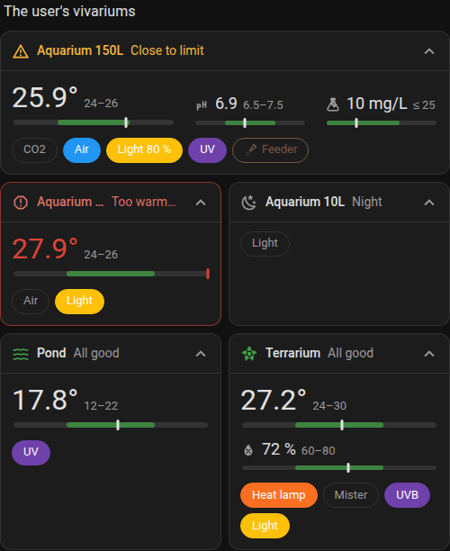

# HA Plooum Vivarium Card

`type: custom:ha-plooum-vivarium-card`

One card per vivarium (an aquarium, a pond, a terrarium, a paludarium...): every sensor and every piece of equipment at a glance, in a compact card that makes a problem obvious without reading.



## Features

- A **strip** at the top shows the vivarium's state and its cause, with one icon per level so the meaning doesn't rely on color alone:

  | Level | When | Example messages |
  | :--- | :--- | :--- |
  | ok | everything within range | `All good` (the vivarium's icon) |
  | info | normal but notable state | `Night` (a light is off), `Off` (every actuator is off and there is no measure) |
  | warn | drifting, or an entity can't be reached | `Close to limit`, `UV unavailable · since 15:02` |
  | alert | out of range, or a critical item is off or unavailable | `Too warm · since 14:20`, `Air off · since 09:12` |

  The message is the most severe cause, followed by `· since <time>` (in your Home Assistant time format; a date when it's older than today) and `· +N` when there are other problems.
- **Measures** (temperature, humidity, pH...): the main one in large type with its target range and a range bar (green target band, a marker that turns red out of range); the others smaller, side by side. An out-of-range value is drawn in red.
- **Actuators** (light, CO2, air pump, UV, heater, mister...): one chip each. Filled in its color = on, outlined = off, amber with `?` = unavailable or missing. A dimmable light shows its %. A tap toggles it (or runs a feeder button/script), a long press opens its more-info dialog.
- **Folding**: folded, the card is a single line (state, main value, one dot per actuator). It folds by itself when it's narrow, or when its height in a sections grid is too small; the chevron folds or unfolds it by hand, and that choice is remembered on the device.
- Follows the Home Assistant theme and dark mode. Built-in visual editor.

## Configuration

### Main options

| Name | Type | Default | Description |
|---|---|---|---|
| `type` | string | **Required** | `custom:ha-plooum-vivarium-card`. |
| `name` | string | vivarium type | Name shown in the strip. |
| `vivarium_type` | string | `aquarium` | `aquarium`, `pond`, `terrarium` or `paludarium`. Sets the default icon, the default target ranges (see **Roles**) and the roles the editor suggests first. It doesn't restrict anything. |
| `icon` | string | from `vivarium_type` | Icon shown in the strip when everything is fine. |
| `strip_style` | string | `quiet` | `quiet`: neutral strip, only a problem colors the icon and text. `tinted`: pale background per level. `solid`: full-color background with white text (wall tablets). In `quiet` and `tinted`, an alert also colors the card's border. |
| `fold` | string | `auto` | `auto`, `folded` or `unfolded`. |
| `fold_below_width` | number | `240` | `auto` only: the card folds below this width, in px. |
| `items` | list | | The vivarium's measures and actuators, see **Items**. |

In a sections view the card is 6 columns wide and its height follows its content. If you set `rows` in `grid_options`, the card folds by itself (in `auto` mode) when the unfolded layout doesn't fit.

### Items (`items`)

| Name | Type | Description |
|---|---|---|
| `role` | string | **Required.** What the entity is, see **Roles**. |
| `entity` | string | **Required.** The entity. A missing entity is shown as unavailable. |
| `name` | string | Label (default: the role's label). |
| `icon` | string | Icon (default: the role's icon). |
| `color` | string | CSS color of the chip or dot (default: the role's color). |
| `unit` | string | Measures: unit (default: the entity's unit, else the role's). |
| `main` | boolean | Measures: the big one (default: the first measure). |
| `min` / `max` | number | Measures: target range (default: the role's range for the vivarium type). Setting one of them drops the default of the other. |
| `warn_margin` | number | Measures: inside the range but closer than this to a limit → warn "Close to limit". |
| `critical` | boolean | Off or unavailable → alert instead of info/warn. |
| `tap_action` | string | `toggle` (default for actuators), `more-info` (default for measures) or `none`. |
| `hold_action` | string | Same choices, default `more-info`. |
| `kind` | string | `custom` role only: `measure` or `actuator`. |

### Roles

| Role | Kind | Default targets | Notes |
|---|---|---|---|
| `temperature` | measure | aquarium 24–26, pond 12–22, terrarium 24–30, paludarium 24–28 | `Too warm` / `Too cold`, margin 0.5 |
| `humidity` | measure | terrarium 60–80, paludarium 70–90 | `Too humid` / `Too dry`, margin 3 |
| `ph` | measure | aquarium 6.5–7.5, pond 7–8.5, paludarium 6.5–7.5 | margin 0.2 |
| `conductivity` | measure | | µS/cm, TDS |
| `water_level` | measure | | `Level high` / `Level low` |
| `light` | actuator | | dimmable (% from a `light`'s brightness or a `number`/`input_number`/`sensor` level); off → info `Night` |
| `co2` | actuator | | |
| `air` | actuator | | air pump, air stone |
| `filter` | actuator | | |
| `uv` | actuator | | UV sterilizer or UVB lamp |
| `heater` | actuator | | heater, heat mat, basking lamp |
| `cooling` | actuator | | fan, chiller |
| `mister` | actuator | | misting, fogger |
| `pump` | actuator | | return or wave pump |
| `feeder` | actuator | | a `button`, `input_button` or `script`: the chip runs it, it's never "off" |
| `custom` | either | | everything comes from the item (`kind`, `name`, `icon`, `color`, `unit`) |

## Examples

### Aquarium

```yaml
type: custom:ha-plooum-vivarium-card
name: Aquarium 150L
vivarium_type: aquarium
items:
  - role: temperature
    entity: sensor.aquarium_150_temperature
  - role: co2
    entity: switch.aquarium_150_co2
  - role: air
    entity: switch.aquarium_150_air
    critical: true
  - role: light
    entity: light.aquarium_150
  - role: custom
    kind: measure
    name: Nitrate
    icon: mdi:flask
    entity: sensor.aquarium_150_no3
    unit: mg/L
    max: 25
```

### Pond, folded on a wall tablet

```yaml
type: custom:ha-plooum-vivarium-card
name: Pond
vivarium_type: pond
strip_style: solid
fold: folded
items:
  - role: temperature
    entity: sensor.pond_temperature
  - role: uv
    entity: switch.pond_uv
```

### Terrarium

```yaml
type: custom:ha-plooum-vivarium-card
name: Terrarium
vivarium_type: terrarium
items:
  - role: temperature
    entity: sensor.terrarium_temperature
  - role: humidity
    entity: sensor.terrarium_humidity
  - role: heater
    name: Heat lamp
    entity: switch.terrarium_heat_lamp
  - role: mister
    entity: switch.terrarium_mister
  - role: uv
    name: UVB
    entity: switch.terrarium_uvb
```
